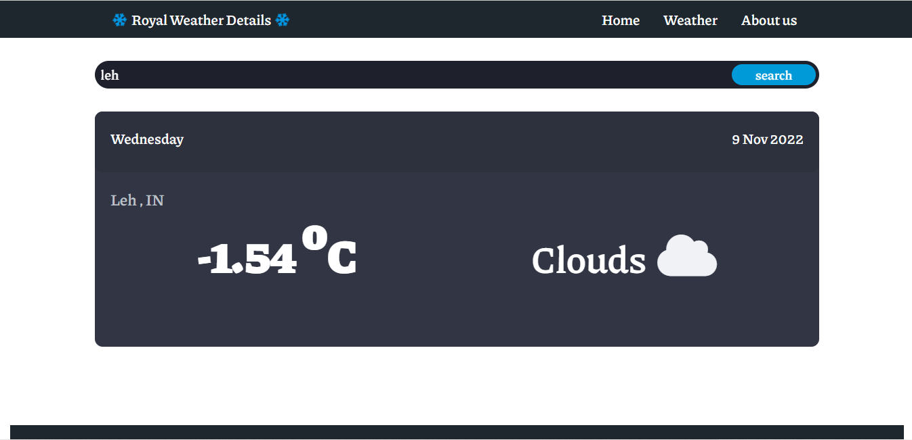

# Weather_application_web_Nodejs

Live Link:
https://weatherinfomania.herokuapp.com/weather

if, you are not able to access above link , the the link is not active anymore..

because it was hosted and deployed on hEROKU for free,, but after 22/nov/2022 ,, it has stopped its free services . So, Automatically our site is also got deactivated.

Soon whenever i'll find a good alternative I'll replace the above link

till then , you can see the preview of the application

##1

##2

##3

